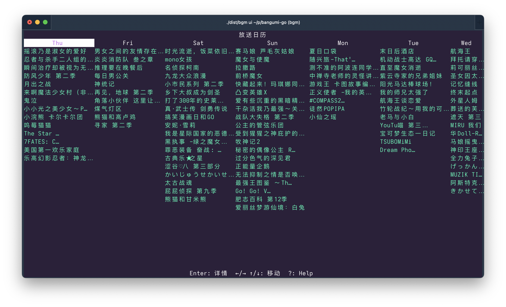
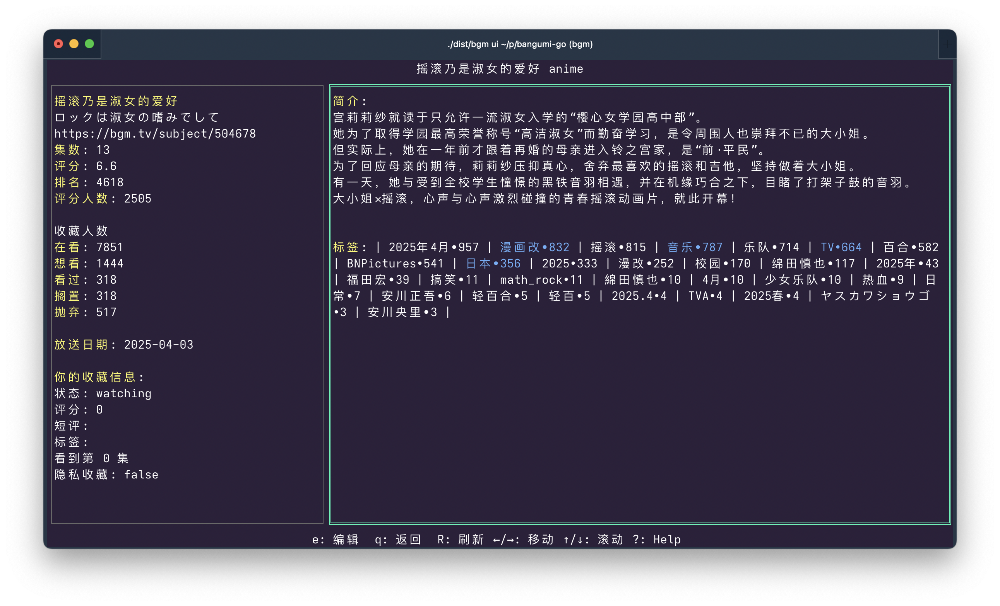
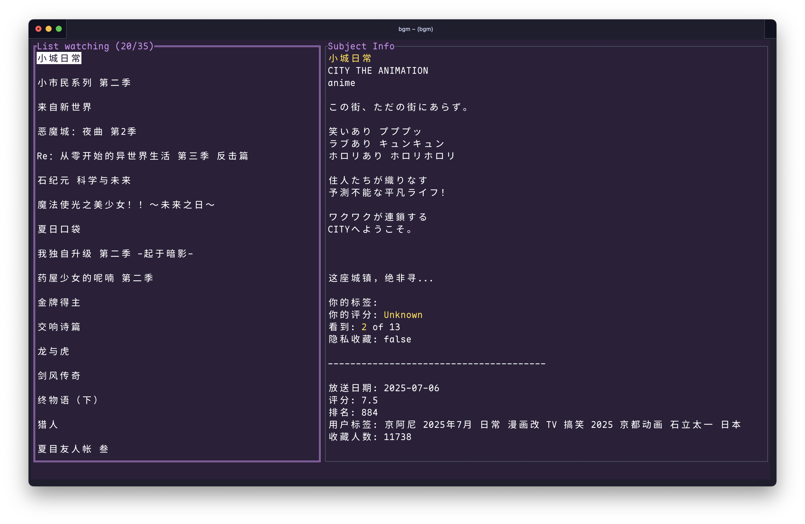
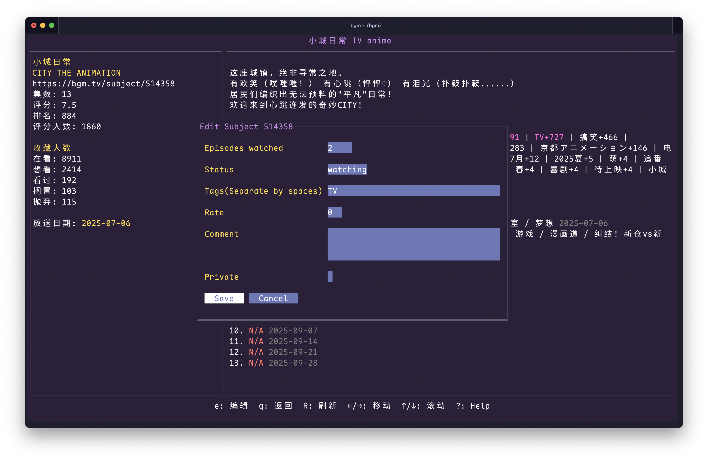

# Bangumi Terminal UI

Bangumi CLI and TUI in Golang

It is under active development and features will change.

## Commands

- `ui` or empty
  Start terminal UI
- `auth`
  Auth commands
- `completion`
  Generate the autocompletion script for the specified shell
- `help`
  Help about any command
- `list`
  List collection
- `sub`
  Subject/Collection actions
- `version`
  Print the version number of bgm-cli
- `cal`
  Show calendar (airing animes)

## Screenshots

Calendar


Sbject


Collection


Edit collection


## Development

Build

```sh
go build -o dist/bgm
```

Lint

```bash
gofumpt -w .
golangci-lint run
```

CLI

`go run . help`

UI

`go run . ui`

## Download

1. Download the binary for your platform from the [Releases](https://github.com/iucario/bangumi-go/releases) page.
2. Make the binary executable (if required) and rename it to `bgm`:

   ```sh
   chmod +x bgm-<platform>-<arch>
   mv bgm-<platform>-<arch> bgm
   ```

3. Move it to a directory in your PATH (e.g., `~/.local/bin/`) to make it easier to use:

   ```sh
   mv bgm ~/.local/bin/
   ```

4. Run the binary:

   ```sh
   bgm
   ```

For Windows, double-click the `.exe` file or run it from the command prompt.

>[!NOTE]
> You will probably be prompted with security warning by the system. It is because `bgm` is not signed. You can either trust the binary, or install from source using Go.

### Tip

If you are not sure about CJK font and have not configured your terminal for Chinese.
It is recommended to use [Maple Mono](https://github.com/subframe7536/maple-font?tab=readme-ov-file#download) for better displaying of Chinese and Japanese.

## Installation with Go

If you have Go installed, you can install the binary directly using the following command:

```sh
go install github.com/iucario/bangumi-go@latest
```

This will install the `bgm` binary in your `$GOPATH/bin` or `$HOME/go/bin` directory. Make sure this directory is in your system's PATH to use the `bgm` command globally.
