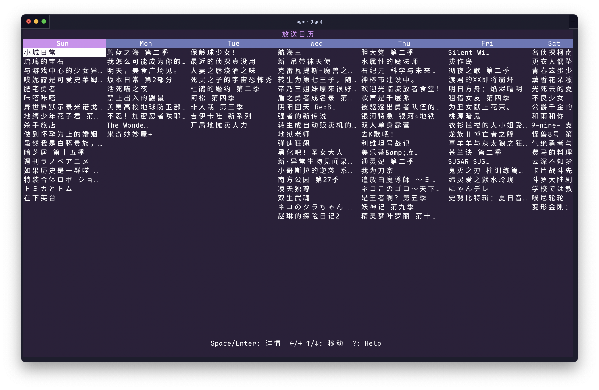
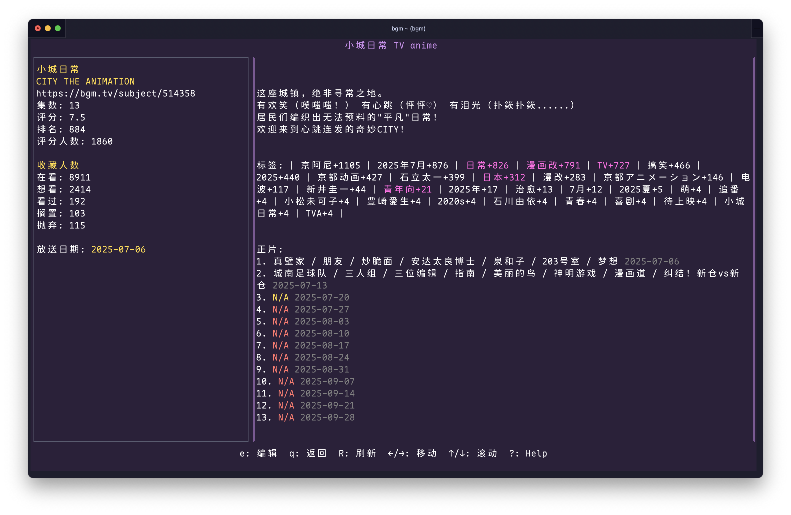

# Bangumi Terminal UI

Bangumi CLI and TUI in Golang

It is under active development and features will change.

## Commands

- `auth`
  Auth commands
- `completion`
  Generate the autocompletion script for the specified shell
- `help`
  Help about any command
- `list`
  List collection
- `sub`
  Subject/Collection actions
- `version`
  Print the version number of bgm-cli
- `cal`
  Show calendar (airing animes)
- `ui`
  Start terminal UI

## Screenshots

Calendar





## Development

Build

```sh
go build -ldflags "-X 'github.com/iucario/bangumi-go/cmd.Version=v0.0.1'" -o dist/bgm
```

Lint

```bash
gofumpt -w .
golangci-lint run
```

CLI

`go run . help`

UI

`go run . ui`
